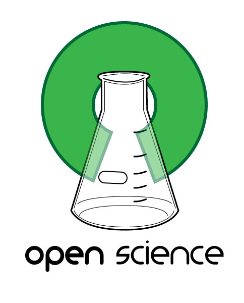
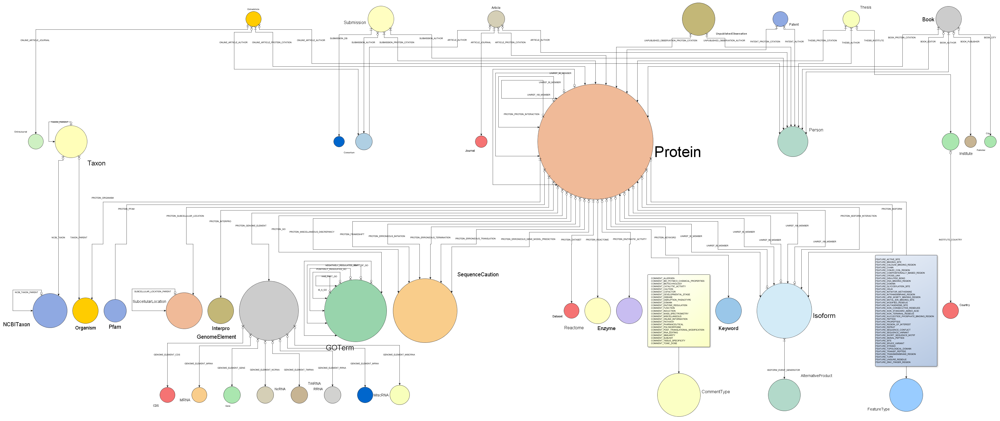

% Bio4j: графовая база данных
% Алексей Алехин
% 29 июля 2014

### Что такое Bio4j?

**Bio4j** — это биоинформатическая _графовая_ база данных, 
содержащая информацию связанную с _протеинами_ из самых 
крупных _открытых_ источников

<!-- 
is a bioinformatics _graph_-based data platform  
**integrating** the most representative **open data sources**  
around **protein information**
 -->

----

### Источники данных
 
+------------------------------------------------------------+------------------------------------------------------------------------------+
|                                                            |                                                                              |
+============================================================+==============================================================================+
|                                                            | * *[UniProt KB](http://www.uniprot.org/help/uniprotkb)* (SwissProt + Trembl) |
|                                                            | * *[Gene Ontology](http://www.geneontology.org/)* (GO)                       |
|  | * *[UniRef](http://www.uniprot.org/help/uniref)* (50,90,100)                 |
|                                                            | * *[RefSeq](http://www.ncbi.nlm.nih.gov/RefSeq/)*                            |
|                                                            | * *[NCBI Taxonomy](http://www.ncbi.nlm.nih.gov/Taxonomy/)*                   |
|                                                            | * *[Expasy Enzyme DB](http://enzyme.expasy.org/)*                            |
+------------------------------------------------------------+------------------------------------------------------------------------------+

----

### Открытость!

* Исходники распространяются под лицензией [**AGPLv3**](https://www.gnu.org/licenses/agpl-3.0.html)
* Интегрированны только открытые данные ([**Open Data**](http://okfn.org/opendata/))
* Процесс разработки на [**GitHub**](https://github.com/bio4j/bio4j) абсолютно прозрачен

<!-- 
* Code is under the [**AGPLv3**](https://www.gnu.org/licenses/agpl-3.0.html) license
* Only [**Open Data**](http://okfn.org/opendata/) is integrated
* Implementation & release process is  
  [**100% public**](https://github.com/bio4j/bio4j) and totally transparent
 -->

----

### Базы данных в биологии

- Огромный объем __взаимосвязанной__ и  
  __пересекающейся__ информации
- распределённой по __разным источникам__
- и хранящейся в __реляционных базах данных__,  
  а иногда даже просто в CSV файлах

\  

Это может быть приемлемо в _простых задачах_, но когда количество _разнородной_ информации увеличивается,  
модель данных становится _слишком сложной_

<!-- 
* Highly **interconnected overlapping** knowledge 
* spread over **different data sources**
* maintained in the **Relational Databases**  
  or sometimes even just as plain **CSV files**

\ 

That might be fine for simple scenarios  
but as the **amount** and **diversity** of data grows,  
**domain models** become _crazily complicated!_
 -->

----

_Это реальная схема базы данных GO_
 
<aside class="notes">
    This is the real schema diagram of the GO database
</aside>

----

### Реляционная модель

В реляционной модели отношение

**Сущность** $\Longleftrightarrow$ **Таблица**

не является взаимным, что порождает

- вспомогательные таблицы
- искуственные идентификаторы
- работу с таблицами представляющими  
  связи, вместо работы с самими связями

<!-- 
With relational paradigm the double implication

**Entity** $\Longleftrightarrow$ **Table**

doesn't go both ways, which implies

* **auxiliary tables**
* **artificial IDs**
* dealing with **raw tables** \
  (in spite of entity-relationship diagrams)

\

**Integrating** new knowledge becomes **difficult**
 -->

----

### Биология $\neq$ Таблица

> - Возможно, __биологическая__  
    информация не на на 100% граф
> - но уж точно __не набор таблиц!__

<!-- 
> * **Life** in general and **biology** in particular  
    are probably not 100% like a graph...
> * but one thing is sure: they _**are not a set of tables!**_
 -->

----

### Графовые базы данных

- Данные хранятся в соответствии  
  со своей **семантической структурой**
- Простота интеграции новых данных  
  ведёт к **масштабируемости**
- **Локальные индексы** (vertex-centric)  
  позволяют избежать проблем с вершинами,  
  которые имеют слишком большое  
  количество связей ([**supernode problem**](http://thinkaurelius.com/2012/10/25/a-solution-to-the-supernode-problem/))

<!-- 
* Data is stored in a way that **semantically represents its own structure**
* Incorporating new data is easy $\Rightarrow$ it's **scalable**
* **Vertex-centric** _(local)_ indices allow to overcome the supernode problem
 -->

----

### Облачные технологии

#### Data as a Service 

- Удобное взаимодействие  
  между сервисами
- Безопасное хранение  
  любого объема данных
- Масштабируемость
- Рентабельность

<!-- 
* Services interoperability
* Data distribution
* Backup and storage
* Scalability
* Cost-effectiveness
 -->

----

## Bio4j

### **=**

### Биологические данные

### **+** 

### Графовые БД

### **+** 

### Облако

<!-- 

### How it all started 

* Need for **massive access** to _Gene Ontology_ annotations
* [**BG7**](http://bg7.ohnosequences.com/) bacterial genome annotation system 
* Need for massive direct access to **protein information**

\ 

### More and more data!

* As _other_ data sources were becoming a _bottleneck_ they were integrated into Bio4j
* First it was Uniprot KB, then Uniref, ... 
* And **we didn't stop yet!**
 -->

----

### Модель данных Bio4j

* $2 \times 10^8$ вершин **$40$ типов**
* $10^9$ связей **$150$ типов**
* $6 \times 10^8$ свойств (аттрибутов)

<!-- exact numbers:
* **`1,216,993,547`** relationships
* `190,625,351` nodes
* `584,436,429` properties
* `144` relationship types
* `42` node types
-->

<aside class="notes">
    Bio4j database has a **well-defined** domain model and all nodes and relationships comply with this abstract model
</aside>

----

### Структура Bio4j

Интегрированные данные имеют модульную структуру,  
позволяющую выделить только интересующие части

<!-- 
The importing process is **modular** and **customizable**  
allowing you to import just the data you are interested in
 -->

<!-- 
### Bio4j module system

[Statika](http://ohnosequences.com/statika) helps to manage dependencies between modules and simplifies import and deployment in the cloud 

<aside class="notes">
    Just keep in mind that you must be **coherent**
    _e.g. you cannot import protein interactions if you didn't import any protein yet!_
</aside>
 -->

----

### Как Bio4j используется в Era7

- [**BG7**](http://bg7.ohnosequences.com/) — система аннотации бактериальных геномов
- [**MG7**](http://era7bioinformatics.com/en/page.cfm?id=464&title=metagenomics:-mg7) — система метагеномного анализа
- Сравнительная геномика, анализ сетей взаимодействия белков, сборка геномов и т.д.

<!-- 
* **BG7** genome annotation
* **MG7** metagenomics analysis
* Comparative genomics, network analysis,  
  genome assembly, ...
 -->

----

### Другие пользователи Bio4j

\ 

#### Ohio State University

- Интеграция и анализ Chip-seq данных
- Моделирование геномной информации  
  и регуляторных генетических сетей

<!-- 
* **Integration** and **analysis** of Chip-seq data
* **Modeling** genomic information and **gene regulatory networks**
 -->

\ 

#### Berkeley Phylogenomics Group

- Графовая БД для геномного анализа  
  разработанная на основе Bio4j

<!-- 
* Graph database for _Big Data challenges_ in **genomics** developed **on top of Bio4j**
 -->

----

### Внутреннее устройство Bio4j

1. Абстрактная **модель данных** с чёткой типизацией
2. Универсальная реализация с помощью [**Blueprints**](https://github.com/tinkerpop/blueprints/)
3. Конкретные реализации:
    * **[Neo4j](https://github.com/neo4j/neo4j)** 
    * **[TitanDB](https://github.com/thinkaurelius/titan/)**
    * **[DynamoDB](http://aws.amazon.com/dynamodb/)** (в разработке)
    * **[OrientDB](https://github.com/orientechnologies/orientdb/)** (планируется)

\ 

_Различная_ __топология графов__ на уровне хранилища,  
но _единая_ __модель данных__ в пользовательском коде

<!-- 
1. Abstract **domain model** with precise typing
2. Universal **[Blueprints](https://github.com/tinkerpop/blueprints/)** implementation
3. **Technology-specific** versions:
    * **[Neo4j](https://github.com/neo4j/neo4j)** 
    * **[Titan](https://github.com/thinkaurelius/titan/)** (WIP)
    * **[OrientDB](https://github.com/orientechnologies/orientdb/)** (planned)

\ 

_Different_ **graph topologies** at the storage level,  
_same_ **domain model** in the client's code
 -->

<aside class="notes">
    This way we’re going one step further for making the domain model **independent** from the choice of _database technology_
        - Neo4j with _labels_ 
        - Titan with _type nodes_
</aside>

----

### Немного технических деталей

- Исходный код на Java и Scala
- **[Statika](http://ohnosequences/statika)** для модульной системы
- **[SBT](https://github.com/sbt/sbt)** для автоматизации  
  сборки кода, тестирования и релизов
- **[Git + Github](https://github.com/bio4j)** для совместной работы  
  и координации всего рабочего процесса

<!-- 
- Java + Scala source code
- **[Statika](http://ohnosequences/statika)**-based module system
- **[SBT](https://github.com/sbt/sbt)** for building sources  
  and automated tests & release
- **[Git + Github](https://github.com/bio4j)**: versioning, docs,  
  collaboration, coordination
 -->

----

### Кто разрабатывает Bio4j

[Ohnosequences!](http://ohnosequences.com)  
исследовательская группа [Era7 bioinformatics](http://era7bioinformatics.com)

|                                                                   |                          |
| ----------------------------------------------------------------: | :----------------------- |
|              [**Pablo Pareja**](http://ohnosequences.com/ppareja) | руководитель проекта     |
| [**Eduardo Pareja-Tobes**](http://ohnosequences.com/eparejatobes) | архитектура и технологии |
|               [**Raquel Tobes**](http://ohnosequences.com/rtobes) | интеграция данных        |
|         [**Marina Manrique**](http://ohnosequences.com/mmanrique) | интеграция данных        |
|           [**Алексей Алехин**](http://ohnosequences.com/aalekhin) | модульная система        |
|             [**Евдоким Ковач**](http://ohnosequences.com/ekovach) | облачная архитектура     |

----

### Контакты

* **Twitter**: [\@bio4j](http://twitter.com/bio4j)
* **Github**: [bio4j](https://github.com/bio4j)
* **Google group**: [bio4j-user](http://groups.google.com/group/bio4j-user)
* **Linkedin**: [bio4j](http://www.linkedin.com/groups/Bio4j-3890937)

 

### **[bio4j.com](http://bio4j.com)**

----

### Спасибо за внимание!

   

_Исходники и последняя версия этой презентации на GutHub'е:_  
[`github.com/laughedelic/bioinformatics-summer-school-2014`](https://github.com/laughedelic/bioinformatics-summer-school-2014)
